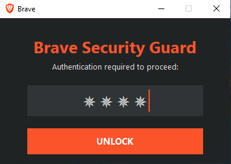

  
  
  

  

---

# BraveLock

**braveLock** is a lightweight Windows utility designed to secure and manage access to the Brave Browser. Protect your personal browsing sessions, bookmarks, and stored data from unauthorized access with quick passcode locking.

---

## 🔒 Features

- **Passcode Protection:** Set a master passcode to unlock and launch the browser.
- **Background Protection:** Prevents direct launching of the browser executable when locked.
- **Lightweight & Fast:** Runs efficiently in the background without affecting browser performance.

---

## ⚙️ Requirements

- **OS:** Windows 10 / 11
- **Python:** Version 3.7 or higher
- **Browser:** Brave Browser installed in the default directory

---
