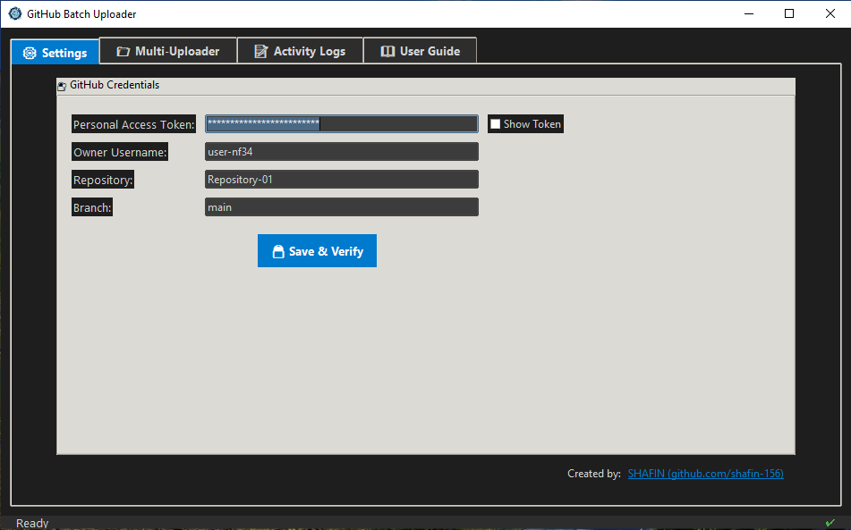
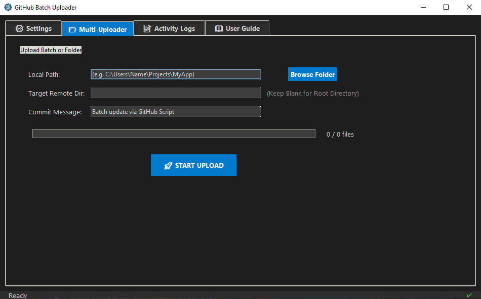

<p align="center">
  
  
  
  
</p>

<h1 align="center">🚀 GitHub Batch Uploader GUI</h1>
<p align="center">
  <a href="EXE-Windows/GitHub%20Uploader%20v2.9.5_Windows.exe">
    
  </a>
</p>

<p align="center">
  <strong>A modern, multi-tabbed Python application that securely uploads entire folders and files to GitHub via the API.</strong>
</p>

<p align="center">
   &nbsp;
  
</p>

---

## ✨ Features

- **Batch & Recursive Uploads:** Upload an entire local directory, including all subfolders and nested files, with a single click.
- **Smart Path Detection:** Select your local folder, and the app instantly auto-fills the remote directory name (e.g., selecting `D:/Projects/bill_calculator` auto-fills `bill_calculator` as the target folder). Fully editable if you need a custom path.
- **Preserves Folder Structure:** Accurately recreates your local directory hierarchy on GitHub. *(Note: GitHub requires at least one file inside a folder to successfully create it).*
- **Robust API Security:** Utilizes GitHub Personal Access Tokens (Classic). Includes a built-in **"Save & Verify"** button to securely test your credentials before initiating uploads.
- **Real-Time Activity Log:** A dedicated logging tab displays live, timestamped feedback (Success ✅ / Errors ❌) so you can track the upload process instantly.
- **Modern Dark UI:** Designed with a sleek, VSCode-inspired dark theme, complete with accent colors and an easily accessible in-app "User Guide" tab.

---

## 📦 Prerequisites & Installation

If you prefer to run the application directly from the source code instead of using the pre-compiled `.exe`, ensure your system meets the following requirements:

### 1. Git Bash / PortableGit
Required to handle underlying Git operations. 
- [Download Git for Windows](https://git-scm.com/install/windows)

### 2. Python 3.7+
Make sure Python is installed and **added to your Windows PATH** during the installation process.
- [Download Python](https://www.python.org/downloads/)

### 3. Installation Steps

Clone the repository and install the required dependencies:

```bash
# Clone the repository
git clone [https://github.com/yourusername/github-batch-uploader.git](https://github.com/yourusername/github-batch-uploader.git)

# Navigate to the project directory
cd github-batch-uploader

# Install required Python packages
pip install requests
